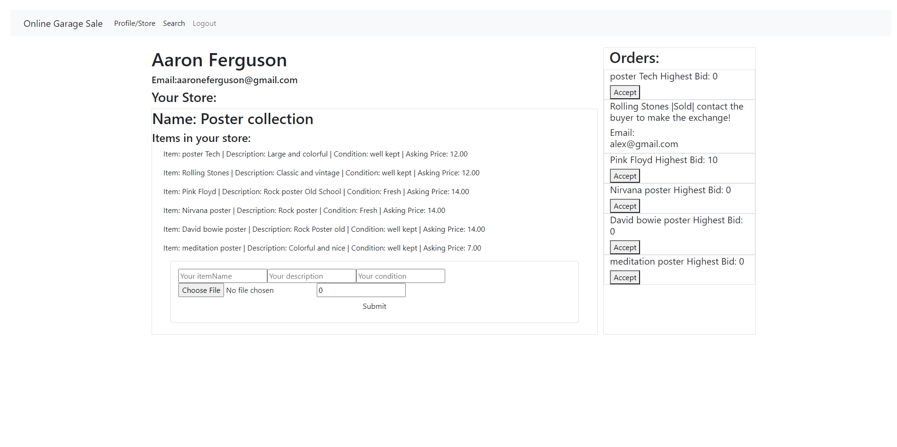

# Online Garage Sale

## Description
This site was made to make an easy place for people to buy and sell there old stuff like a garage sale. Whether it or not the whether is good enough for a yard sale you still can with this website. It stores your items allows bids on your items until you except then gives you a way to connect the buyer and seller. 

## Table of Contents

* [Deployment](#deployment)
* [Installation](#installation)
* [Screenshots](#screenshots)

## Deployment
This site is deployed to heroku with a mongodb atlas data base configured in it.
the link to the deployed site is https://banana-tart-96962.herokuapp.com/

## Installation
To work on the repo, start with cloning or downloading the repo. Run npm install then npm start:dev to run the application

## Screenshots

This screenshot shows the stores available.

This screenshot shows items and my store I have on this account.
)

### in progress schema

